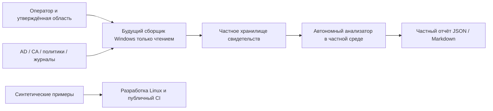

# Архитектура

Реализован автономный MVP; сборщик Windows остаётся проектом. Основание: [требования](requirements.md) и [модель угроз](threat-model.md).

Реальные данные не загружаются в публичный проект или этот облачный workspace. Обезличивание реальной выгрузки не делает её автоматически допустимым примером.

## Реализованные компоненты

`schema.py` — единый декларативный контракт; `validation.py` — ограниченный разбор и проверка типов/ссылок; `rules.py` — девять правил baseline-v1; `report.py` — детерминированные JSON и экранированный Markdown; `cli.py` — команды и создание только нового файла. [Контракт](input-contract.md) описывает точные поля, состояния и ограничения.

Ввод состоит из метаданных, логических свидетельств и нормализованных фактов. Положительный вывод возможен только при всех необходимых фактах, complete покрытии и непустых корректных ссылках. Истинность утверждений независимо не подтверждается. Ссылки не открываются как файлы/URL. Нет сетевых запросов или выполнения строк.

Отчёт содержит версии, SHA256 точных входных байтов, область/источник/UTC, происхождение, результаты, критичность/уверенность, нарушения, рекомендации и ограничения. Время запуска не используется; порядок результатов и ссылок стабилен. Тексты на русском и UTF-8, JSON корректно экранирует Unicode; ключи и enum сохранены.

## Будущий сбор и ограничения

Планируемый сборщик: утверждённая область, обнаружение возможностей, разрешённые операции чтения, страницы, бюджет запросов, отмена, источник и полнота. Не поставляется. Не реализованы разбор исходных дескрипторов, обход графа SID/групп, полноценные эффективные ACL и доверия, собственный сбор AD CS/политик/журналов, криптографическая подпись происхождения.

Полное вычисление ACL должно учитывать порядок ACE, наследование, GUID, deny, SID history и границы доверия. Политика, её применение и наблюдаемое поведение разделены. Риск AD CS связан с сочетанием условий, но MVP не покрывает все ESC. Готовность восстановления определяется датированными независимыми свидетельствами учения, а не обещанием восстановить лес.

Новая проверка требует ID в матрице, описания источника/прав/ограничений, положительных/отрицательных/неполных примеров и реального Windows-свидетельства для сбора. Совместимость Windows Server 2019/2022/2025 пока not_run. Публикация отдельно проверяет тег и скачанные артефакты; SHA256 не является подписью владельца.
