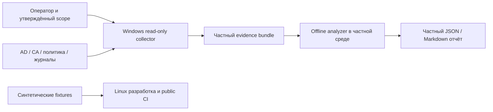

# Архитектура

Статус: offline MVP реализуется; Windows collector остаётся проектом. Основание: [требования](requirements.md) и [угрозы](threat-model.md).

## Поток данных

Linux onboarding не подключён к AD. Реальный bundle анализируется только в согласованной частной среде, а не загружается в этот публичный проект. Обезличивание реальной выгрузки не делает её автоматически допустимым fixture.

## Компоненты и обязанности

Collector: explicit scope manifest, capability discovery, source-specific read adapters, pagination, budgets, provenance и coverage; никаких правил исправления. Normalizer: schema validation, SID/GUID resolution с unresolved markers, timestamp UTC, источник effective policy, без потери неизвестных прав. Rule engine: чистые функции над immutable model, версия набора правил, finding/check IDs, отдельные severity/confidence. Reporter: safe escaping, минимизация identifiers, JSON для машин и Markdown для человека. Storage: частная файловая система, ACL/шифрование на уровне ОС, срок хранения, отсутствие фоновой загрузки.

## Будущий контракт bundle v1

Manifest: schema_version, collector_version, rules_version, collected_at UTC, synthetic boolean, scope, source OS/module versions, checks, coverage, file hashes. Каждый check: check_id, status, evidence_refs, reason. Raw evidence: минимальные атрибуты, source ID и timestamp; passwords/private keys/event secrets запрещены. Findings: rule_id, check_id, severity, confidence, evidence_refs, explanation, recommendation и limitations. Неизвестная schema version отвергается; миграции — явные. Хэши проверяют целостность, но не удостоверяют подлинность AD. Synthetic fixtures этого этапа проверяют только модель статусов, не являются полной схемой bundle.

## Надёжность и безопасность

Недоступный источник получает unknown с причиной и областью; успешно прочитанные соседние источники не маскируют пробел. Детерминированная сортировка, bounded traversal membership с cycle detection, deadline и cancellation. Никакого dynamic execution из directory strings. ACL interpretation учитывает ACE order, inheritance, object types, deny, SID history и доверия; неполный context понижает confidence и запрещает категорический вывод об эффективном доступе.

Configured policy, applied policy и observed behavior хранятся раздельно. Риск AD CS — комбинация template/CA/enrollment/ACL условий, а не ярлык по одному flag. Recovery readiness — evidence с датой последнего успешного drill, не обещание восстановить лес.

## Расширения и поддержка

Новый check требует ID в матрице, bounded read API, минимальных прав, threat review, positive/negative/missing fixtures и Windows evidence. Возможные будущие каталоги: collector/, analyzer/, schemas/, tests/; сейчас они не создаются как реализация. Совместимость Windows Server 2019/2022/2025 будет проверяться явно; поддержка не заявляется по наличию документа.

## Реализованный offline MVP boundary

`ad_opsec_auditor/schema.py` — declarative contract; `validation.py` — bounded parsing/validation; `rules.py` — девять deterministic baseline checks; `report.py` — JSON/escaped Markdown; `cli.py` — validate/audit/schema и exclusive output. Input v1 описан в [контракте](input-contract.md). Не является обещанным raw collector bundle: no raw SD parsing, SID graph traversal или подписанного provenance. Facts подготавливает доверенный оператор; analyzer не делает сетевых запросов. Частное использование synthetic=false отмечается unverified.
